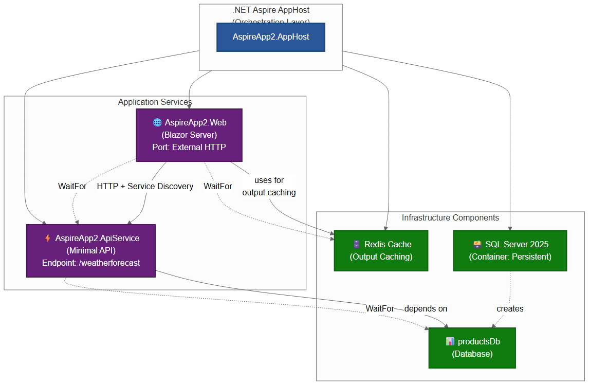

# Solution Overview: AspireApp2

*Generated on: November 25, 2025 at 18:27:58*

## Overview

AspireApp2 is a cloud-native distributed application built with .NET Aspire 9.3 that demonstrates modern microservices architecture patterns with built-in observability, service orchestration, and resilience. The solution showcases a weather forecast service through a Blazor Server frontend communicating with a backend Minimal API, supported by Redis caching and SQL Server persistence.

**Purpose:** Demonstrate .NET Aspire's capabilities for building production-ready, observable distributed applications with minimal configuration overhead.

**Key Technologies:**
- .NET 9.0
- .NET Aspire 9.3.x
- Blazor Server (Interactive Server Components)
- ASP.NET Core Minimal APIs
- Redis (Output Caching)
- SQL Server 2025 (Containerized with persistent volumes)
- OpenTelemetry (Distributed Tracing, Metrics, Logging)

**Target Audience:** Developers building cloud-native microservices applications requiring built-in observability, automatic service discovery, and standardized resilience patterns.

## Architecture

AspireApp2 implements a **microservices architecture** with the following core principles:

### Design Principles
- **Service-Oriented Architecture:** Clear separation between frontend presentation and backend API services
- **Container-First Infrastructure:** All infrastructure components run in containers with persistent storage
- **Observability by Default:** OpenTelemetry instrumentation across all services for metrics, traces, and logs
- **Service Discovery:** Automatic registration and DNS-based discovery between microservices
- **Resilience Patterns:** Standard retry, timeout, and circuit breaker policies on all HTTP communication
- **Health Monitoring:** Liveness and readiness probes for all services

### Infrastructure Components
- **Redis Cache:** In-memory caching layer for output caching to improve web application performance
- **SQL Server 2025:** Relational database running in a container with persistent data volumes
- **OpenTelemetry Collector:** Centralized telemetry aggregation for metrics, traces, and logs
- **.NET Aspire Dashboard:** Real-time monitoring and visualization of service health, dependencies, and telemetry

### Architecture Diagram



**Key Relationships:**
- **AppHost Orchestration:** Manages lifecycle of all services and infrastructure components
- **Web → API Communication:** HTTP calls with automatic service discovery (`https+http://apiservice`)
- **Web → Redis:** Output caching integration for improved response times
- **API → Database:** Connection to SQL Server `productsDb` database
- **Startup Dependencies:** 
  - `webfrontend` waits for both `cache` and `apiservice` to be ready
  - `apiservice` waits for `productsDb` to be available

## Components

### 1. AspireApp2.AppHost

**Type:** .NET Aspire Orchestrator (Console Application)

**Role:** Central orchestration hub that configures, launches, and manages all microservices, databases, and infrastructure resources.

**Key Responsibilities:**
- Register and configure all application services
- Define service dependencies and startup ordering with `WaitFor` chains
- Configure infrastructure resources (Redis, SQL Server) with container settings
- Manage container lifecycles and persistent volumes
- Provide service discovery and configuration propagation

**Orchestration Configuration:**
```csharp
// SQL Server with persistent container and 2025-latest image
var sql = builder.AddSqlServer("sql")
    .WithLifetime(ContainerLifetime.Persistent)
    .WithImageTag("2025-latest")
    .WithEnvironment("ACCEPT_EULA", "Y");

// Database with data volume for persistence
var productsDb = sql.WithDataVolume().AddDatabase("productsDb");

// Redis cache for output caching
var cache = builder.AddRedis("cache");

// API Service depends on database
var apiService = builder.AddProject<Projects.AspireApp2_ApiService>("apiservice")
    .WithReference(productsDb)
    .WaitFor(productsDb);

// Web frontend depends on cache and API
builder.AddProject<Projects.AspireApp2_Web>("webfrontend")
    .WithExternalHttpEndpoints()
    .WithReference(cache).WaitFor(cache)
    .WithReference(apiService).WaitFor(apiService);
```

**NuGet Packages:**
- `Aspire.Hosting.AppHost` 9.3.1
- `Aspire.Hosting.Redis` 9.3.1
- `Aspire.Hosting.SqlServer` 9.3.2
- `Aspire.Hosting.Azure.ApplicationInsights` 9.3.1
- `Aspire.Hosting.Azure.CognitiveServices` 9.3.1

**User Secrets ID:** `e50803cf-4486-4be1-a751-019caf04024d`

---

### 2. AspireApp2.Web

**Type:** Blazor Server Application with Interactive Server Components

**Role:** Frontend web application providing user interface and consuming backend API services.

**Key Features:**
- **Server-Side Rendering:** Blazor Server with streaming for fast initial page loads
- **Output Caching:** Redis-backed caching with 5-second duration on Weather page
- **Service Discovery:** Automatic HTTP client configuration using `https+http://apiservice`
- **Interactive Components:** Real-time UI updates via SignalR
- **Responsive Design:** Bootstrap-based responsive layout

**Pages & Routes:**
- `/` - Home page with solution introduction
- `/counter` - Interactive counter demonstration (Blazor interactivity showcase)
- `/weather` - Weather forecast display with API data and output caching
- `/Error` - Error handling page

**Dependencies:**
- `AspireApp2.ServiceDefaults` - Shared cross-cutting concerns
- Redis Cache - Via `AddRedisOutputCache("cache")`
- `AspireApp2.ApiService` - Weather data via typed HTTP client

**Implementation Details:**
- **`WeatherApiClient`:** Typed HTTP client with streaming JSON enumerable pattern
- **Service Discovery URL:** `https+http://apiservice` (HTTPS preferred, HTTP fallback)
- **Output Cache Attribute:** `[OutputCache(Duration = 5)]` on Weather component
- **Stream Rendering:** `[StreamRendering(true)]` for progressive page load

**Configuration:**
```json
{
  "TargetFramework": "net9.0",
  "NuGet": ["Aspire.StackExchange.Redis.OutputCaching 9.3.1"]
}
```

---

### 3. AspireApp2.ApiService

**Type:** ASP.NET Core Minimal API

**Role:** Backend REST API providing weather forecast data with OpenAPI documentation.

**Key Features:**
- **Minimal API Architecture:** Lightweight, high-performance endpoint definitions
- **OpenAPI/Swagger:** Auto-generated API documentation in development mode
- **Random Weather Data:** Generates 5-day forecasts with realistic temperature ranges
- **Health Checks:** Built-in health endpoints via ServiceDefaults
- **Database Ready:** Configured with `productsDb` reference for future data operations

**API Endpoints:**

**`GET /weatherforecast`**
- **Description:** Returns a 5-day weather forecast
- **Response:** `200 OK` with JSON array of `WeatherForecast` objects
- **Schema:**
  ```json
  {
    "date": "2025-11-26",
    "temperatureC": 18,
    "temperatureF": 64,
    "summary": "Mild"
  }
  ```

**Weather Summaries:** Freezing, Bracing, Chilly, Cool, Mild, Warm, Balmy, Hot, Sweltering, Scorching

**Database Integration:**
- **Database Name:** `productsDb` (SQL Server)
- **Current Usage:** Configured but not yet actively used in code
- **Future Ready:** Connection configured via Aspire service reference

**Dependencies:**
- `AspireApp2.ServiceDefaults` - Common configurations and telemetry

**Configuration:**
```json
{
  "TargetFramework": "net9.0",
  "NuGet": ["Microsoft.AspNetCore.OpenApi 9.0.7"]
}
```

---

### 4. AspireApp2.ServiceDefaults

**Type:** Shared Class Library

**Role:** Provides common cross-cutting concerns and standardized configurations shared across all services.

**Key Features:**

#### Service Defaults Extension
```csharp
builder.AddServiceDefaults();
```
Configures:
- OpenTelemetry instrumentation
- Service discovery client
- HTTP client with standard resilience handlers
- Default health checks

#### OpenTelemetry Configuration
**Metrics Instrumentation:**
- ASP.NET Core (request duration, active requests, etc.)
- HTTP Client (outbound request metrics)
- Runtime (GC, thread pool, exception metrics)

**Tracing Instrumentation:**
- ASP.NET Core (request spans)
- HTTP Client (outbound request spans)
- Application-specific traces (via `ActivitySource`)

**Logging:**
- Structured logging with formatted messages
- Scope inclusion for contextual information
- OpenTelemetry log exporter

**Exporters:**
- OTLP Exporter (configured via `OTEL_EXPORTER_OTLP_ENDPOINT` environment variable)
- Azure Monitor support (commented code, ready for integration)

#### HTTP Client Defaults
```csharp
builder.Services.ConfigureHttpClientDefaults(http =>
{
    http.AddStandardResilienceHandler();  // Retry, timeout, circuit breaker
    http.AddServiceDiscovery();           // Automatic DNS-based discovery
});
```

#### Health Checks
- **Liveness Probe:** Self-check always returns healthy
- **Readiness Probe:** Can be extended with dependency checks
- **Endpoint:** `/health` (mapped via `MapDefaultEndpoints()`)

**Extension Methods:**
- `AddServiceDefaults<TBuilder>()` - Main configuration entry point
- `ConfigureOpenTelemetry<TBuilder>()` - Telemetry setup
- `AddDefaultHealthChecks<TBuilder>()` - Health monitoring

---

### 5. AspireApp2.Tests

**Type:** xUnit Test Project

**Role:** Integration and unit tests for web application functionality.

**Test Files:**
- `WebTests.cs` - Basic web application tests

**Testing Approach:**
- Integration tests using `Microsoft.AspNetCore.Mvc.Testing`
- Test against actual Blazor components and pages
- Verifies service integrations and component rendering

## Features

### User-Facing Functionality

#### Weather Forecast Display
- Browse 5-day weather predictions with temperatures in Celsius and Fahrenheit
- Real-time data fetched from backend API
- Cached for 5 seconds to improve performance
- Stream rendering for fast perceived load times

#### Interactive Counter
- Demonstration of Blazor's interactive server components
- Real-time UI updates via SignalR connection
- Showcases stateful component behavior

#### Responsive User Interface
- Bootstrap-based responsive design
- Works seamlessly on desktop, tablet, and mobile devices
- Professional navigation and layout

### API Capabilities

#### RESTful Weather API
- **Endpoint:** `GET /weatherforecast`
- **Format:** JSON
- **Data:** 5-day forecast with date, temperatures, and summary

#### OpenAPI Documentation
- Swagger UI available in development mode at `/openapi/v1.json`
- Interactive API exploration and testing
- Auto-generated from endpoint definitions

#### Service Discovery
- Automatic endpoint resolution between services
- No hardcoded URLs required
- HTTPS-first with HTTP fallback (`https+http://` scheme)

### Data Management

#### Output Caching Strategy
- **Technology:** Redis-backed output caching
- **Cache Duration:** 5 seconds on Weather page
- **Benefits:** Reduced API calls, improved response times
- **Scope:** Per-request caching with automatic invalidation

#### Database Integration
- **Database:** SQL Server 2025 (`productsDb`)
- **Persistence:** Data volumes for durability across container restarts
- **Container Lifetime:** Persistent (survives host restarts)
- **Current State:** Configured and ready for CRUD operations

#### Connection Management
- Automatic connection pooling via Entity Framework Core (when implemented)
- Connection string injected via Aspire service references
- No hardcoded connection strings

### Observability & Monitoring

#### Distributed Tracing
- End-to-end request tracing across all services
- Trace IDs propagated via W3C Trace Context
- Spans for HTTP requests, database calls, and custom operations
- Visualization in Aspire Dashboard

#### Metrics Collection
- **HTTP Metrics:** Request duration, status codes, concurrent requests
- **Runtime Metrics:** CPU usage, memory, GC collections, thread pool
- **Custom Metrics:** Application-specific counters and gauges

#### Structured Logging
- Consistent log format across all services
- Contextual information with scopes
- Log levels configurable per namespace
- Centralized log aggregation

#### Aspire Dashboard
- **URL:** `https://localhost:17187` (or `http://localhost:15273`)
- **Features:**
  - Real-time service status and health
  - Distributed trace visualization
  - Log streaming and search
  - Metrics charts and dashboards
  - Resource dependency graph

## Technical Details

### Platform & Runtime
- **.NET Version:** 9.0
- **.NET Aspire SDK:** 9.0.0
- **.NET Aspire Packages:** 9.3.1 - 9.3.2
- **Language Features:** C# 12 with implicit usings and nullable reference types

### Key NuGet Packages

**AppHost:**
- Aspire.Hosting.AppHost 9.3.1
- Aspire.Hosting.Redis 9.3.1
- Aspire.Hosting.SqlServer 9.3.2
- Aspire.Hosting.Azure.ApplicationInsights 9.3.1
- Aspire.Hosting.Azure.CognitiveServices 9.3.1

**Web:**
- Aspire.StackExchange.Redis.OutputCaching 9.3.1

**ApiService:**
- Microsoft.AspNetCore.OpenApi 9.0.7

**ServiceDefaults:**
- OpenTelemetry.Extensions.Hosting
- OpenTelemetry.Instrumentation.AspNetCore
- OpenTelemetry.Instrumentation.Http
- OpenTelemetry.Instrumentation.Runtime
- Microsoft.Extensions.ServiceDiscovery

### Authentication & Authorization

**Current State:** No authentication implemented

**Architecture Readiness:**
- Ready for ASP.NET Core Identity integration
- Can integrate with Azure AD, Auth0, or other identity providers
- API can be secured with JWT bearer tokens
- Frontend can use cookie-based authentication

**Service-to-Service Communication:**
- Currently uses internal service discovery (no authentication)
- Can be enhanced with mutual TLS or API keys in production

### Service Discovery & Resilience

#### Service Discovery
- **Technology:** DNS-based service discovery via Aspire's built-in resolver
- **Scheme Resolution:** `https+http://` pattern for automatic HTTPS preference with HTTP fallback
- **Name Resolution:** Service names resolve to internal container endpoints
- **Configuration:** No explicit configuration required

#### Resilience Patterns
Configured via `AddStandardResilienceHandler()`:

**Retry Policy:**
- Transient failure detection
- Exponential backoff
- Maximum retry attempts

**Circuit Breaker:**
- Failure threshold monitoring
- Half-open state testing
- Automatic recovery

**Timeout Policy:**
- Request-level timeouts
- Configurable per endpoint

### Container Configuration

#### SQL Server
```yaml
Image: mcr.microsoft.com/mssql/server:2025-latest
Lifetime: Persistent (survives restarts)
Data Volume: Attached for data persistence
Environment: ACCEPT_EULA=Y
Database: productsDb
```

#### Redis
```yaml
Image: redis:latest (default)
Lifetime: Session (tied to AppHost lifecycle)
Port: Dynamically assigned
```

### Deployment Considerations

#### Container Orchestration
- **Target Platforms:** Azure Container Apps, AKS, Docker Compose, Kubernetes
- **Manifest Generation:** Aspire generates deployment manifests automatically
- **Configuration:** Environment-based with User Secrets in development

#### Scaling Strategy
- **Stateless Services:** Web and API can scale horizontally
- **Stateful Services:** Redis and SQL Server require persistent storage
- **Load Balancing:** Automatic via container orchestration platform

#### Data Persistence
- SQL Server data volumes survive container restarts
- Redis can be configured with persistence if needed
- Backup strategies should be implemented for production

#### Cloud-Native Features
- **Health Checks:** Ready for Kubernetes liveness and readiness probes
- **Configuration:** 12-factor app compliant with environment-based config
- **Telemetry:** OpenTelemetry for vendor-agnostic observability
- **Service Mesh Ready:** Can integrate with Istio, Linkerd, or Dapr

### Development Features

#### Hot Reload
- Supported for rapid development iterations
- Changes to Razor components and C# code apply without restart

#### Watch Mode
- `dotnet watch` available for automatic recompilation
- File watching for code changes

#### Local Development
- Docker Desktop required for containers
- Aspire Dashboard provides development-time monitoring
- User Secrets for sensitive configuration

#### Debugging
- Multi-project debugging supported in Visual Studio 2022
- Breakpoints work across all services
- Telemetry visible in Aspire Dashboard during debugging

### Security Considerations

#### HTTPS
- Enabled by default with automatic HTTPS redirection
- Development certificates for local HTTPS

#### HSTS
- HTTP Strict Transport Security enabled in production
- Preload-ready configuration

#### Antiforgery Protection
- Token validation for forms and state-changing operations
- Automatic token generation in Blazor components

#### User Secrets
- Development secrets stored securely outside source control
- User Secrets ID: `e50803cf-4486-4be1-a751-019caf04024d`

#### Container Security
- Non-root user configuration recommended for production
- Minimal base images to reduce attack surface
- Regular image updates for security patches

### Project Structure & Best Practices

#### Separation of Concerns
- **Presentation Layer:** Blazor components and pages
- **API Layer:** Minimal API endpoints
- **Orchestration:** AppHost project
- **Shared Logic:** ServiceDefaults library

#### Code Organization
- **Components:** Organized by feature in `Components/Pages`
- **API:** Simple, focused endpoint definitions
- **Tests:** Separate test project with integration tests

#### Configuration Management
- `appsettings.json` for default configuration
- `appsettings.Development.json` for development overrides
- `launchSettings.json` for launch profiles
- Environment variables for deployment-specific settings

## Getting Started

### Prerequisites
- **.NET 9.0 SDK** - [Download](https://dot.net)
- **Docker Desktop** - For SQL Server and Redis containers
- **Visual Studio 2022** (recommended) or VS Code with C# extension

### Running the Application

1. **Ensure Docker Desktop is Running**
   ```powershell
   docker ps
   ```

2. **Launch the Aspire Host**
   ```powershell
   dotnet run --project src/AspireApp2.AppHost/AspireApp2.AppHost.csproj
   ```

3. **Access the Aspire Dashboard**
   - HTTPS: `https://localhost:17187`
   - HTTP: `http://localhost:15273`

4. **Navigate to Services**
   - Use the dashboard to find service URLs
   - Click on the `webfrontend` endpoint to open the Blazor application

### Development Workflow

1. **Start Development**
   - Run the AppHost project from Visual Studio or CLI
   - AppHost automatically starts all containers and services

2. **Monitor Services**
   - Use Aspire Dashboard for real-time monitoring
   - View traces, logs, and metrics
   - Check service health and dependencies

3. **Make Changes**
   - Edit code in Web or ApiService projects
   - Changes apply with hot reload (Blazor) or restart (API)

4. **Test Changes**
   - Run integration tests: `dotnet test`
   - Manual testing via browser and Swagger UI

5. **Debugging**
   - Set breakpoints in Visual Studio
   - Multi-project debugging supported
   - View telemetry in Aspire Dashboard

### Project Commands

```powershell
# Build entire solution
dotnet build src/AspireApp2.sln

# Run tests
dotnet test src/AspireApp2.Tests/AspireApp2.Tests.csproj

# Run specific project
dotnet run --project src/AspireApp2.Web/AspireApp2.Web.csproj

# Watch mode for development
dotnet watch --project src/AspireApp2.Web/AspireApp2.Web.csproj

# Generate Aspire deployment manifest
dotnet run --project src/AspireApp2.AppHost -- --publisher manifest --output-path ../aspire-manifest.json
```

## Future Enhancements

### Potential Areas for Expansion

#### Database Operations
- Implement actual CRUD operations using Entity Framework Core
- Add database migrations for schema management
- Utilize the configured `productsDb` for real data persistence

#### Authentication & Authorization
- Integrate ASP.NET Core Identity
- Add Azure AD or external identity provider support
- Implement role-based access control (RBAC)
- Secure API endpoints with JWT tokens

#### Additional Services
- Add message queue integration (Azure Service Bus, RabbitMQ, Kafka)
- Implement gRPC communication between services for high-performance scenarios
- Add BFF (Backend for Frontend) pattern for API aggregation

#### Advanced Features
- Implement CQRS pattern with MediatR
- Add event sourcing for audit trails
- Integrate Azure Cognitive Services (already referenced in AppHost)
- Add Application Insights for production telemetry

#### Testing
- Expand integration test coverage
- Add end-to-end tests with Playwright
- Implement load testing with k6 or JMeter
- Add contract testing for API stability

#### DevOps & Deployment
- Set up CI/CD pipelines (GitHub Actions, Azure DevOps)
- Deploy to Azure Container Apps
- Configure Azure Key Vault for secrets management
- Implement blue-green or canary deployment strategies

---

*This documentation was automatically generated by analyzing the AspireApp2 solution structure, source code, configuration files, and AppHost orchestration logic. Generated with .NET Aspire Solution Documenter (Mermaid variant).*
