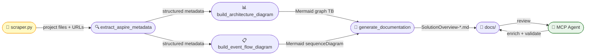
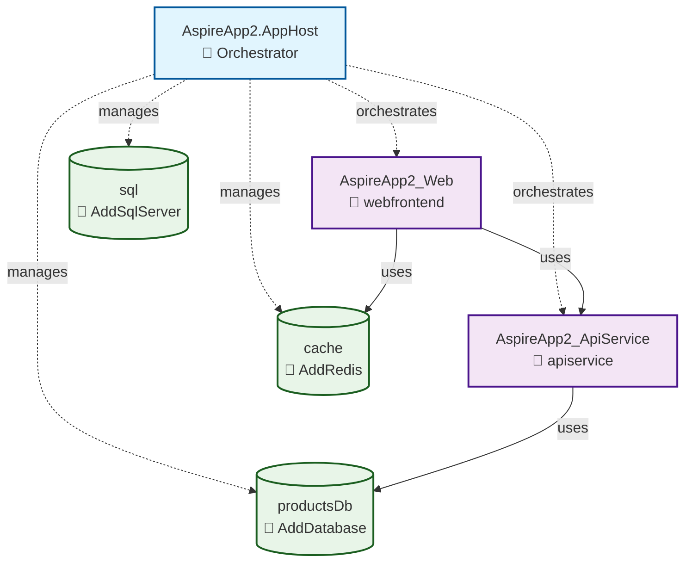
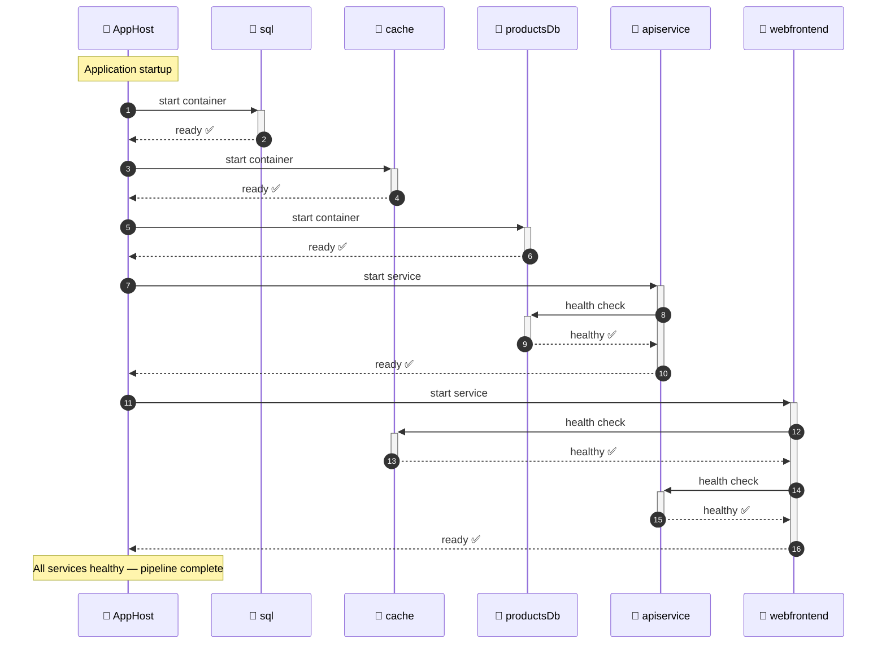

# Solution Overview

## Overview

This solution is a **.NET Aspire**-based distributed application generated and documented automatically
by the AgentCamp Madrid 2026 pipeline — combining **Aspire**, **MCP Agents**, **Python scraping**, and
**Mermaid visualisation**.

## Goal and Purpose

- Demonstrate automated documentation generation from a live microservices solution
- Show how Python scraping + AI agents can extract and enrich architecture knowledge
- Produce Mermaid diagrams (architecture, event flows, pipeline) as first-class documentation artefacts
- Provide a continuous pipeline from code → documentation ready for production

## Documentation Pipeline



## Architecture

### Architecture Diagram (Mermaid)



### Architecture Diagram (ASCII)

```
+---------------------------+
|  AspireApp2.AppHost       |
|  🎯 Orchestrator          |
+---------------------------+
    |          |         |
    v          v         v
+-------+  +------+  +--------+
| Web   |  | API  |  |Resources|
| 🌐    |  | 🔗   |  | 💾      |
+-------+  +------+  +--------+
    |          |
    v          v
 Cache        DB
```

## Event Flow (Startup Sequence)



## Services

| Name | Class | Type |
|------|-------|------|
| `apiservice` | `AspireApp2_ApiService` | .NET Aspire project |
| `webfrontend` | `AspireApp2_Web` | .NET Aspire project |

## Resources

| Name | Type | Role |
|------|------|------|
| `sql` | `SqlServer` | External container |
| `cache` | `Redis` | External container |
| `productsDb` | `Database` | External container |

## API Endpoints

| Method | Path | Source |
|--------|------|--------|
| `Get` | `/weatherforecast` | `AspireApp2.ApiService/Program.cs` |

## Scraping Summary

| Property | Value |
|----------|-------|
| Files scanned | 22 |
| Timestamp | 2026-02-27T17:21:56.379887 |
| Services detected | 2 |
| Resources detected | 3 |
| Endpoints detected | 1 |

## Technology Stack

- **.NET Aspire** — distributed application orchestration
- **Blazor / Minimal API** — frontend and backend services
- **Redis** — output caching
- **SQL Server** — persistent storage
- **Python** — scraping and pipeline automation
- **Mermaid** — architecture and event-flow visualisation
- **MCP Agents** — intelligent documentation enrichment

---

*Generated automatically by `pipeline.py` on 20260227-172156*
